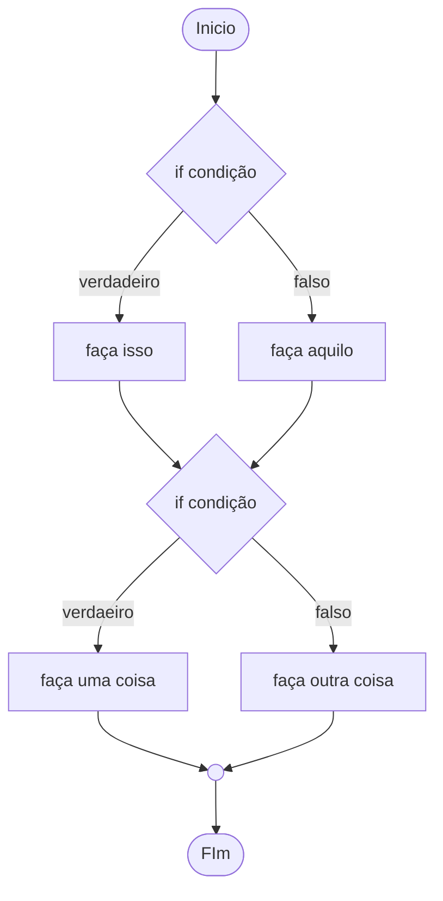
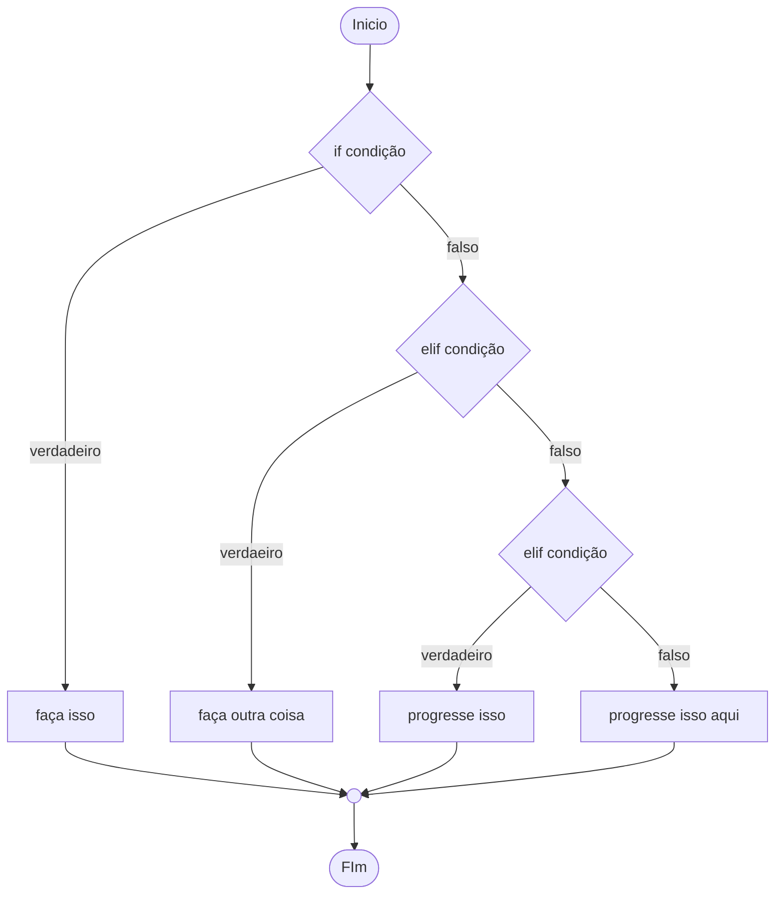
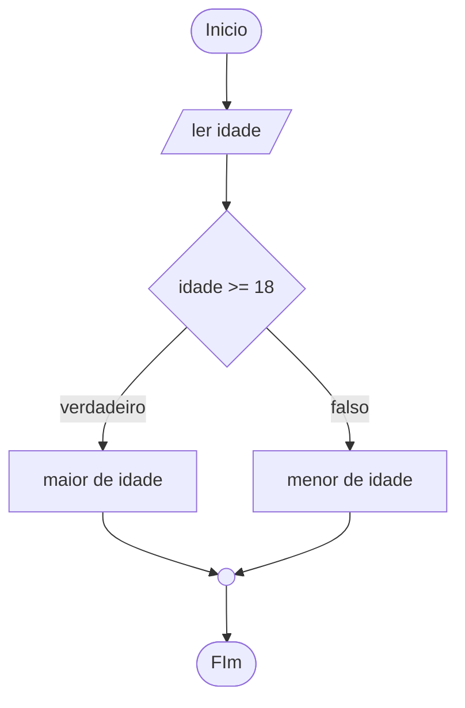
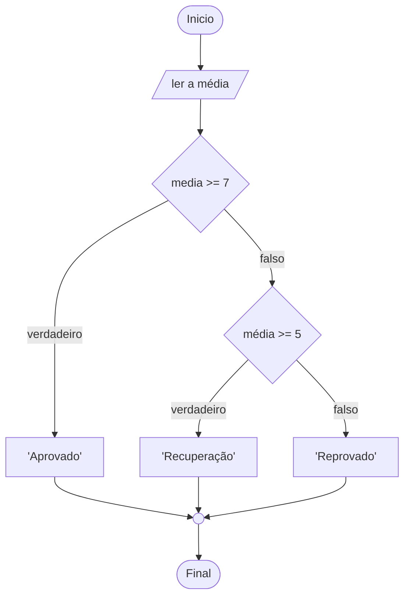

# Condicionais

## Estruturas condicionais

Sem as estruturas condicionais, todas as linhas do código(exceto os comentários) são executados.
Para estabelecer uma condição que execute uma linha ou outra é necessário criar estruturas de controle de fluxo.
Essas estruturas fazem com que as linhas executadas sejam alteradas dependendo da condição. No caso de laços
de repetição, podemos executar várias vezes o mesmo bloco de código.

Existe dois tipos de controle de fluxo:

1. Condicionais
1. Laços de repetição

### If, elif e else

- if(se): executa se uma condição for verdadeira.
- elif(então se): se o if de cima for falso, é verificado.
- else(do contrário): é executdo se todas as condições forem falsas.

### Fluxo do if



### Fluxo do elif



> - if: fluxo independente
> - elif: apenas verifica a condição, se o if acima for falso
> - else: verifica apenas, se todas as condições forem falsas

> Você também pode usar valores lógicos, como o **and** e o **or**.
>
> Com o **And** a condição só se torna verdadeira, se as duas condições forem verdadeiras.
>
> Com o **Or** a condição é verdadeira se pelo menos uma for verdadeira.
>
> Para melhor entendimento, pesquise sobre tabela verdade

## Exemplos

1. Programa que ler a idade de uma pessoa e retorna se ela é maior ou menor de idade.

Fluxograma:



Código

```python
idade = int(input('Quantos anos você tem: '))

if idade >= 18:
    print('Você é de maior')
else:
    print('Você é de menor')
```

<hr>

2. Numa instituição de ensino, cada aluno é aprovado se a média for maior ou igual a 7,
   para ir para recuperação é necessário pelo menos 5, caso contrário, o aluno é reprovado.

Fluxograma:



Código:

```python
media = float(input('Digite a média: '))

if media >= 7:
    print('Aprovado ')
elif media >= 5:
    print('Recuperação')
else:
    print('Reprovado')
```

<hr>

3. Numa instituição de ensino o aluno só passa se a média for acima de 7, e a presença for
   de 70%. O aluno só tem direito a recuperação, caso o mesmo tenha uma média acima de 5 e uma
   presença de 70%.

Código:

```python
media = float(input('Digite a média: '))
presença = int(input('Digite a porcentagem de presença: '))

if (media >= 7) and (presença >= 70):
    print('Aprovado')
elif (media >= 5) and (presença >= 70):
    print('Recuperação')
else:
    print('Reprovado')
```
