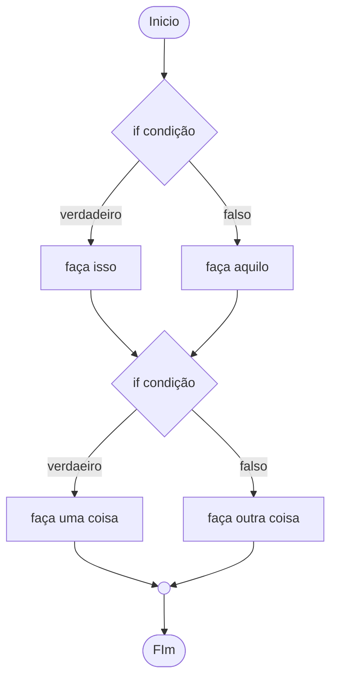
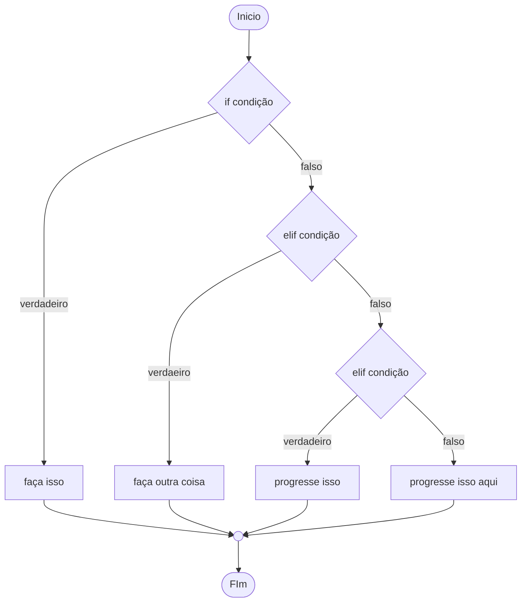
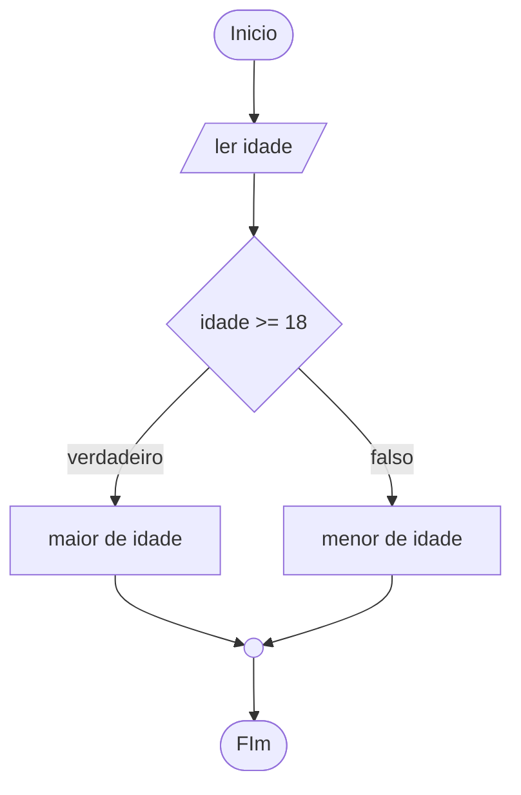
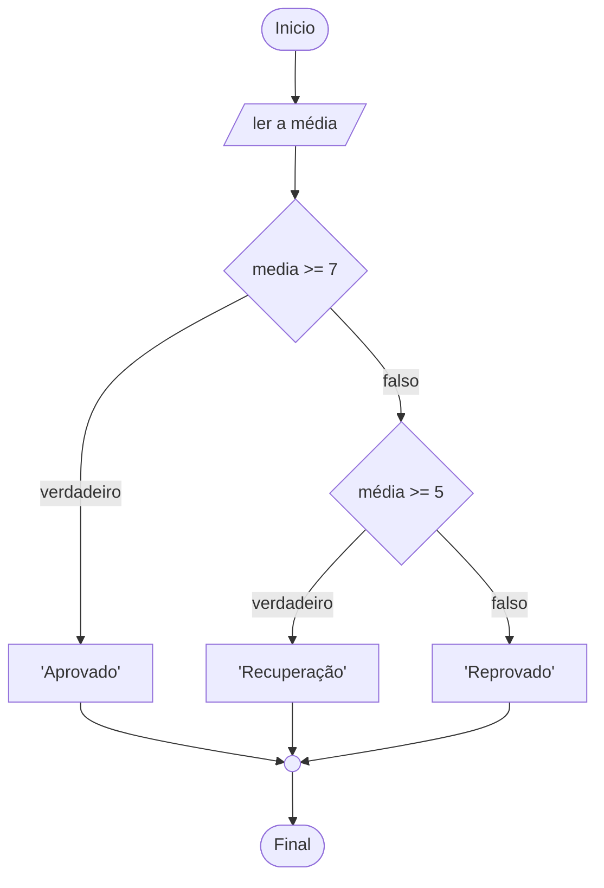

# Condicionais

## Estruturas condicionais

Sem as estruturas condicionais, todas as linhas do código(exceto os comentários) são executados.
Para estabelecer uma condição que execute uma linha ou outra é necessário criar estruturas de controle de fluxo.
Essas estruturas fazem com que as linhas executadas sejam alteradas dependendo da condição. No caso de laços
de repetição, podemos executar várias vezes o mesmo bloco de código.

Existe dois tipos de controle de fluxo:

1. Condicionais
1. Laços de repetição

### If, elif e else

- if(se): executa se uma condição for verdadeira.
- elif(então se): se o if de cima for falso, é verificado.
- else(do contrário): é executdo se todas as condições forem falsas.

### Fluxo do if



### Fluxo do elif



> - if: fluxo independente
> - elif: apenas verifica a condição, se o if acima for falso
> - else: verifica apenas, se todas as condições forem falsas

> Você também pode usar valores lógicos, como o **and** e o **or**.
>
> Com o **And** a condição só se torna verdadeira, se as duas condições forem verdadeiras.
>
> Com o **Or** a condição é verdadeira se pelo menos uma for verdadeira.
>
> Para melhor entendimento, pesquise sobre tabela verdade

## Exemplos

1. Programa que ler a idade de uma pessoa e retorna se ela é maior ou menor de idade.

Fluxograma:



Código

```python
idade = int(input('Quantos anos você tem: '))

if idade >= 18:
    print('Você é de maior')
else:
    print('Você é de menor')
```

<hr>

2. Numa instituição de ensino, cada aluno é aprovado se a média for maior ou igual a 7,
   para ir para recuperação é necessário pelo menos 5, caso contrário, o aluno é reprovado.

Fluxograma:



Código:

```python
media = float(input('Digite a média: '))

if media >= 7:
    print('Aprovado ')
elif media >= 5:
    print('Recuperação')
else:
    print('Reprovado')
```

<hr>

3. Numa instituição de ensino o aluno só passa se a média for acima de 7, e a presença for
   de 70%. O aluno só tem direito a recuperação, caso o mesmo tenha uma média acima de 5 e uma
   presença de 70%.

Código:

```python
media = float(input('Digite a média: '))
presença = int(input('Digite a porcentagem de presença: '))

if (media >= 7) and (presença >= 70):
    print('Aprovado')
elif (media >= 5) and (presença >= 70):
    print('Recuperação')
else:
    print('Reprovado')
```

## Exercicios

- [Exercício 028:](/exercicios/05-condicionais/exercicios/028_jogo_advinhe_0_5/028_de_0_5.py) Escreva um programa que faça o computador “pensar” em um número inteiro entre 0 e 5 e peça para o usuário tentar descobrir qual foi o número escolhido pelo computador. O programa deverá escrever na tela se o usuário venceu ou perdeu.

- [Exercício 029:](/exercicios/05-condicionais/exercicios/029_radar%20eletronico/029_multa_km.py) Escreva um programa que leia a velocidade de um carro. Se ele ultrapassar 80Km/h, mostre uma mensagem dizendo que ele foi multado. A multa vai custar R$7,00 por cada Km acima do limite.

- [Exercício 030:](/exercicios/05-condicionais/exercicios/030_par_ou_impar/030_par_ou_impar.py) Crie um programa que leia um número inteiro e mostre na tela se ele é PAR ou ÍMPAR.

- [Exercício 031:](/exercicios/05-condicionais/exercicios/031_custo_viagem/031_passagem.py) Desenvolva um programa que pergunte a distância de uma viagem em Km. Calcule o preço da passagem, cobrando R$0,50 por Km para viagens de até 200Km e R$0,45 parta viagens mais longas.

- [Exercício 032:](/exercicios/05-condicionais/exercicios/032_ano_bissexto/032_ano_bissexto.py) Faça um programa que leia um ano qualquer e mostre se ele é bissexto.

- [Exercício 033:](/exercicios/05-condicionais/exercicios/033_maior_menor_valor/033_maior_menor.py) Faça um programa que leia três números e mostre qual é o maior e qual é o menor.

- [Exercício 034:](/exercicios/05-condicionais/exercicios/034_aumentos_multiplos/034_aumento_salarial.py) Escreva um programa que pergunte o salário de um funcionário e calcule o valor do seu aumento. Para salários superiores a R$1250,00, calcule um aumento de 10%. Para os inferiores ou iguais, o aumento é de 15%.

- [Exercício 035:](/exercicios/05-condicionais/exercicios/035_analisando_triangulo/035_triangulo.py) Desenvolva um programa que leia o comprimento de três retas e diga ao usuário se elas podem ou não formar um triângulo.

- [Exercício 036:](/exercicios/05-condicionais/exercicios/036_aprovando_emprestimo/036_Emprestimo.py) Escreva um programa para aprovar o empréstimo bancário para a compra de uma casa. Pergunte o valor da casa, o salário do comprador e em quantos anos ele vai pagar. A prestação mensal não pode exceder 30% do salário ou então o empréstimo será negado.

- [Exercício 037:](/exercicios/05-condicionais/exercicios/037_conversor_base_binario/037_conversor_binario.py) Escreva um programa em Python que leia um número inteiro qualquer e peça para o usuário escolher qual será a base de conversão: 1 para binário, 2 para octal e 3 para hexadecimal.Escreva um programa em Python que leia um número inteiro qualquer e peça para o usuário escolher qual será a base de conversão: 1 para binário, 2 para octal e 3 para hexadecimal.

- [Exercício 038:](/exercicios/05-condicionais/exercicios/038_comparando_numeros/038_maior.py) Escreva um programa que leia dois números inteiros e compare-os. mostrando na tela uma mensagem:

  - O primeiro valor é maior

  - O segundo valor é maior

  - Não existe valor maior, os dois são iguais

- [Exercício 039:](/exercicios/05-condicionais/exercicios/039_alistamento_militar/039_exercito.py) Faça um programa que leia o ano de nascimento de um jovem e informe, de acordo com a sua idade, se ele ainda vai se alistar ao serviço militar, se é a hora exata de se alistar ou se já passou do tempo do alistamento. Seu programa também deverá mostrar o tempo que falta ou que passou do prazo.

- [Exercício 040:](/exercicios/05-condicionais/exercicios/040_media_com_aprovacao/040_media.py) Crie um programa que leia duas notas de um aluno e calcule sua média, mostrando uma mensagem no final, de acordo com a média atingida:

  - Média abaixo de 5.0: REPROVADO

  - Média entre 5.0 e 6.9: RECUPERAÇÃO

  - Média 7.0 ou superior: APROVADO

- [Exercício 041:](/exercicios/05-condicionais/exercicios/041_classificando_atletas/041_classificador_natacao.py) A Confederação Nacional de Natação precisa de um programa que leia o ano de nascimento de um atleta e mostre sua categoria, de acordo com a idade:

  - Até 9 anos: MIRIM

  - Até 14 anos: INFANTIL

  - Até 19 anos: JÚNIOR

  - Até 25 anos: SÊNIOR

  - Acima de 25 anos: MASTER

- [Exercício 042:](/exercicios/05-condicionais/exercicios/042_analisando_triangulo_condicional/042_triangulo.py) Refaça o DESAFIO 35 dos triângulos, acrescentando o recurso de mostrar que tipo de triângulo será formado:

  - EQUILÁTERO: todos os lados iguais

  - ISÓSCELES: dois lados iguais, um diferente

  - ESCALENO: todos os lados diferentes

- [Exercício 043:](/exercicios/05-condicionais/exercicios/043_indice_massa_corporal/043_imc.py) Desenvolva uma lógica que leia o peso e a altura de uma pessoa, calcule seu Índice de Massa Corporal (IMC) e mostre seu status, de acordo com a tabela abaixo:

  - IMC abaixo de 18,5: Abaixo do Peso

  - Entre 18,5 e 25: Peso Ideal

  - 25 até 30: Sobrepeso

  - 30 até 40: Obesidade

  - Acima de 40: Obesidade Mórbida

- [Exercício 044:](/exercicios/05-condicionais/exercicios/044_gerenciando_pagamentos/044_gerenciador_pagamentos.py) Elabore um programa que calcule o valor a ser pago por um produto, considerando o seu preço normal e condição de pagamento:

  - à vista dinheiro/cheque: 10% de desconto

  - à vista no cartão: 5% de desconto

  - em até 2x no cartão: preço formal

  - 3x ou mais no cartão: 20% de juros

- [Exercício 045:](/exercicios/05-condicionais/exercicios/045_pedra_papel_tesoura/045_pedra_papel_tesoura.py) Crie um programa que faça o computador jogar Jokenpô com você.