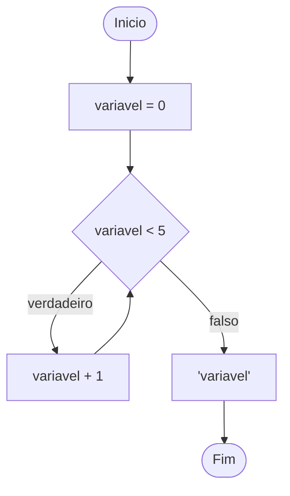

# Laço de repetição

Laço de repetição é um controle de fluxos que permite que um bloco de código seja executado repetidamente com base em uma determinada condição.

# While

O while é executado até que uma determinada condição seja verdadeira.

No exemplo a seguir, veremos um loop de 0 até 5, que em for seria `for i in range(0, 6):`



Em código ficaria assim:

```python
numero = 5
while numero < 5:
    numero += 1
print(numero)
```

Enquanto a condição for verdadeira, o laço continua. Então se você quiser criar um loop infinito, basta declarar o `while` como `True`,
e utilizar o `break` para _quebrar_ o loop:

```python
while True:
    break
```

Podemos utilizar o `while` para validar entradas de dados, criando um loop infinito, para quebrar apenas quando a condição for validada.

```python
while True:
    numero = int(input( 'Digite um número entre 0 e 20: '))
    if 0 <= numero <= 20
        break
    print('Tente novamente :(')
```

# Exercicios

- [Exercício 057:](<https://github.com/andre-jnr/estudos-python/tree/main/exercicios/07%20-%20repeti%C3%A7%C3%A3o%20(while)/exercicios/057_validacao_de_dados>) Faça um programa que leia o sexo de uma pessoa, mas só aceite os valores ‘M’ ou ‘F’. Caso esteja errado, peça a digitação novamente até ter um valor correto.

- [Exercício 058:](<https://github.com/andre-jnr/estudos-python/tree/main/exercicios/07%20-%20repeti%C3%A7%C3%A3o%20(while)/exercicios/058_jogo_da_advinhacao>) Melhore o jogo do DESAFIO 28 onde o computador vai “pensar” em um número entre 0 e 10. Só que agora o jogador vai tentar adivinhar até acertar, mostrando no final quantos palpites foram necessários para vencer.

- [Exercício 059:](<https://github.com/andre-jnr/estudos-python/tree/main/exercicios/07%20-%20repeti%C3%A7%C3%A3o%20(while)/exercicios/059_menu_opcoes_calculadora>) Crie um programa que leia dois valores e mostre um menu na tela, seu programa deverá realizar a operação solicitada em cada caso do menu abaixo.

        [ 1 ] somar

        [ 2 ] multiplicar

        [ 3 ] maior

        [ 4 ] novos números

        [ 5 ] sair do programa

- [Exercício 060:](<https://github.com/andre-jnr/estudos-python/tree/main/exercicios/07%20-%20repeti%C3%A7%C3%A3o%20(while)/exercicios/060_calculo_fatorial>) Faça um programa que leia um número qualquer e mostre o seu fatorial. Exemplo:

        5! = 5 x 4 x 3 x 2 x 1 = 120

- [Exercício 061:](<https://github.com/andre-jnr/estudos-python/tree/main/exercicios/07%20-%20repeti%C3%A7%C3%A3o%20(while)/exercicios/061_progressao_aritmetica>) Refaça o DESAFIO 51, lendo o primeiro termo e a razão de uma PA, mostrando os 10 primeiros termos da progressão usando a estrutura `while`.

- [Exercício 062:](<https://github.com/andre-jnr/estudos-python/tree/main/exercicios/07%20-%20repeti%C3%A7%C3%A3o%20(while)/exercicios/062_super_progressao_aritmetica>) Melhore o DESAFIO 61, perguntando para o usuário se ele quer mostrar mais alguns termos. O programa encerrará quando ele disser que quer mostrar 0 termos.

- [Exercício 063:](<https://github.com/andre-jnr/estudos-python/tree/main/exercicios/07%20-%20repeti%C3%A7%C3%A3o%20(while)/exercicios/063_sequencia_fibonacci>) Escreva um programa que leia um número N inteiro qualquer e mostre na tela os N primeiros elementos de uma Sequência de Fibonacci. Exemplo:

        0, 1, 1, 2, 3, 5, 8

- [Exercício 064:](<https://github.com/andre-jnr/estudos-python/tree/main/exercicios/07%20-%20repeti%C3%A7%C3%A3o%20(while)/exercicios/064_tratando_varios_valores>) Crie um programa que leia vários números inteiros pelo teclado. O programa só vai parar quando o usuário digitar o valor 999, que é a condição de parada. No final, mostre quantos números foram digitados e qual foi a soma entre eles (desconsiderando o flag).

- [Exercício 065:](<https://github.com/andre-jnr/estudos-python/tree/main/exercicios/07%20-%20repeti%C3%A7%C3%A3o%20(while)/exercicios/065_maior_menor_media>) Crie um programa que leia vários números inteiros pelo teclado. No final da execução, mostre a média entre todos os valores e qual foi o maior e o menor valores lidos. O programa deve perguntar ao usuário se ele quer ou não continuar a digitar valores.

- [Exercício 066:](<https://github.com/andre-jnr/estudos-python/tree/main/exercicios/07%20-%20repeti%C3%A7%C3%A3o%20(while)/exercicios/066_soma_quant>) Crie um programa que leia números inteiros pelo teclado. O programa só vai parar quando o usuário digitar o valor 999, use o `break` para a condição de parada. No final, mostre quantos números foram digitados e qual foi a soma entre elas (desconsiderando o flag).

- [Exercício 067:](<https://github.com/andre-jnr/estudos-python/tree/main/exercicios/07%20-%20repeti%C3%A7%C3%A3o%20(while)/exercicios/067_tabuada>) Faça um programa que mostre a tabuada de vários números, um de cada vez, para cada valor digitado pelo usuário. O programa será interrompido quando o número solicitado for negativo.

- [Exercício 068:](<https://github.com/andre-jnr/estudos-python/tree/main/exercicios/07%20-%20repeti%C3%A7%C3%A3o%20(while)/exercicios/068_par_ou_impar>) Faça um programa que jogue par ou ímpar com o computador. O jogo só será interrompido quando o jogador perder, mostrando o total de vitórias consecutivas que ele conquistou no final do jogo.

- [Exercício 069:](<https://github.com/andre-jnr/estudos-python/tree/main/exercicios/07%20-%20repeti%C3%A7%C3%A3o%20(while)/exercicios/069_analise_dados_grupo>) Crie um programa que leia a idade e o sexo de várias pessoas. A cada pessoa cadastrada, o programa deverá perguntar se o usuário quer ou não continuar. No final, mostre:

  - quantas pessoas tem mais de 18 anos.

  - quantos homens foram cadastrados.

  - quantas mulheres tem menos de 20 anos.

- [Exercício 070:](<https://github.com/andre-jnr/estudos-python/tree/main/exercicios/07%20-%20repeti%C3%A7%C3%A3o%20(while)/exercicios/070_estatistica_produtos>) Crie um programa que leia o nome e o preço de vários produtos. O programa deverá perguntar se o usuário vai continuar ou não. No final, mostre:

  - qual é o total gasto na compra.

  - quantos produtos custam mais de R$1000.

  - qual é o nome do produto mais barato.

- [Exercício 071:](<https://github.com/andre-jnr/estudos-python/tree/main/exercicios/07%20-%20repeti%C3%A7%C3%A3o%20(while)/exercicios/071_simulador_caixa_eletronico>) Crie um programa que simule o funcionamento de um caixa eletrônico. No início, pergunte ao usuário qual será o valor a ser sacado (número inteiro) e o programa vai informar quantas cédulas de cada valor serão entregues.

  - considere que o caixa possui cédulas de R$50, R$20, R$10 e R$1.
